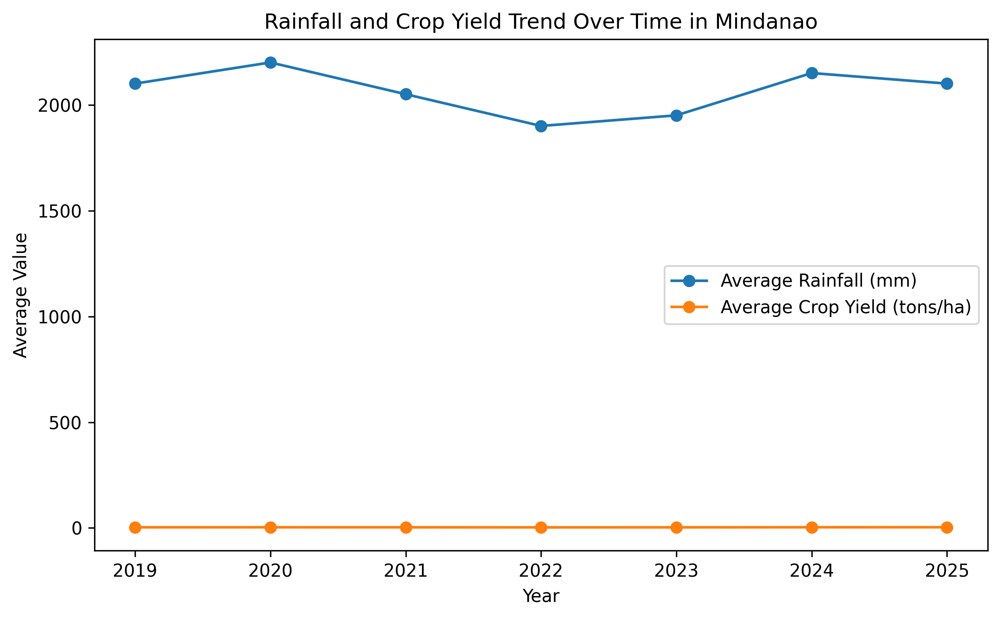
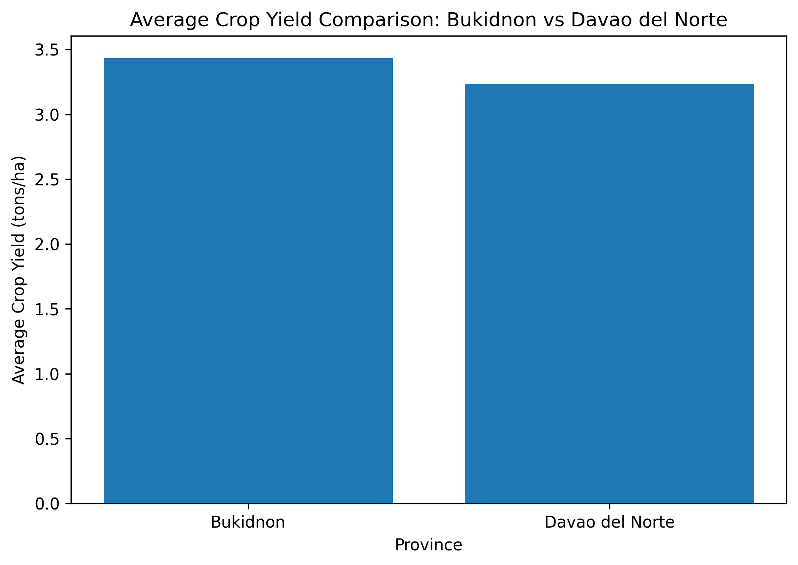

# Mindanao Climate-Agriculture Data Analysis Report

### Data Analytics & Visual Report

#### Dataset Focus: Climate Factors and Agricultural Productivity Trends in Mindanao (AI-Assisted CSV Analysis)

## 1. Data Cleaning Protocol Log

- **Raw Input Problem:**  
The uploaded CSV dataset contained regional climate and agriculture records including year, province, crop type, crop yield, rainfall measurements, and temperature anomalies. The dataset required structural validation to ensure that numerical values, location labels, and agricultural indicators were properly formatted for analysis.

- **AI Cleaning Instruction:**  
`"Act as a Data Analyst working for a Regional Development Council in Mindanao. Inspect this dataset structure, identify formatting problems, missing values, inconsistencies, and data quality issues. Clean the dataset and provide a summary of the structural adjustments made. Prepare the data for visualization and trend analysis."`

- **AI Cleaning Adjustments Performed:**  
  - Verified the dataset structure and confirmed proper column organization.
  - Checked for missing values and incomplete records.
  - Validated numerical formatting for crop yield, rainfall, and temperature anomaly variables.
  - Standardized province and crop category labels.
  - Checked and confirmed the absence of duplicate records.
  - Prepared the dataset for climate-agriculture trend visualization.

- **Result:**  
Successfully validated and prepared 42 agricultural climate observations from Mindanao provinces. The cleaned dataset was transformed into a structured format suitable for identifying relationships between environmental conditions and agricultural productivity.

---

# 2. Visualizations Generated
## Visualization 1: Rainfall and Crop Yield Trend Over Time

*(Embedded High-Contrast Line Chart showing rainfall changes and crop yield performance across recorded years in Mindanao.)*

**Analysis:**  
The visualization presents how rainfall patterns and crop yield values changed over time. By comparing climate conditions with agricultural output, the chart helps identify possible relationships between environmental changes and farming productivity.

## Visualization 2: Average Crop Yield Comparison Between Bukidnon and Davao del Norte

*(Embedded High-Contrast Bar Chart comparing agricultural productivity levels between two Mindanao provinces.)*

**Analysis:**  
The comparison highlights differences in agricultural performance between Bukidnon and Davao del Norte. These variations may reflect differences in local farming conditions, climate exposure, and agricultural resource availability.

# 3. Human Analytical Narrative (The "Why" Factor)

The data visualization shows that agricultural productivity in Mindanao is influenced by changing climate conditions, particularly rainfall patterns and temperature variations. While the AI-assisted analysis identifies numerical trends between climate indicators and crop yield performance, human interpretation connects these patterns to the broader socio-environmental reality experienced by farming communities.

Agriculture remains a major economic activity in Mindanao, where farmers depend heavily on stable environmental conditions for consistent production. Changes in rainfall availability and temperature conditions can affect crop growth cycles, productivity levels, and the overall sustainability of agricultural livelihoods.

The findings emphasize the importance of climate-resilient agricultural planning. Regional policymakers and LGU agricultural departments can use data-driven insights such as these to support improved farming strategies, strengthen climate adaptation programs, and allocate resources toward sustainable agricultural development in Mindanao.

## Project Conclusion

This AI-assisted data analysis demonstrates how raw regional datasets can be transformed into meaningful visual reports. Through automated cleaning, visualization, and human interpretation, climate and agricultural information can support evidence-based decision-making for regional development planning.
